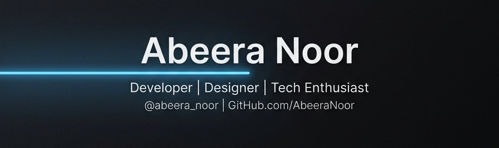

  
  
   
  
  <h1>Hi 👋, I'm <a href="https://linkedin.com/in/abeeranoor2202" target="_blank">Abeera Noor</a></h1>
  
  <h3>
    
  </h3>

---

### 🚀 Quick Glance

  <table>
    <tr>
      <td align="left">🔭 <b>Currently working on</b></td>
      <td align="left"><code>InVIte</code></td>
    </tr>
    <tr>
      <td align="left">🌱 <b>Currently learning</b></td>
      <td align="left"><code>JavaScript</code>, <code>PHP</code></td>
    </tr>
    <tr>
      <td align="left">👯 <b>Looking to collaborate on</b></td>
      <td align="left"><code>ZentaCode</code></td>
    </tr>
    <tr>
      <td align="left">💬 <b>Ask me about</b></td>
      <td align="left"><code>HTML</code>, <code>CSS</code>, <code>Python</code></td>
    </tr>
    <tr>
      <td align="left">📫 <b>How to reach me</b></td>
      <td align="left"><a href="mailto:abeeranoor2202@gmail.com"><code>abeeranoor2202@gmail.com</code></a></td>
    </tr>
    <tr>
      <td align="left">⚡ <b>Fun fact</b></td>
      <td align="left"><i>Professional Independence seeker!</i> 🚀</td>
    </tr>
  </table>

---

### 🛠️ Tech Stack

  
<b>Frontend Development</b>

  

    
    
    
    
    
    
    
    
  

  
<b>Backend & Databases</b>

  

    
    
    
    
    
    
    
  

  
<b>DevOps & Cloud</b>

  

    
    
    
    
    
    
  

  
<b>Design & Tools</b>

  

    
    
    
    
  

---

### 📊 GitHub Stats

  
   
  

---

### 📈 Contribution Graph

  
   
  

### 🤝 Connect with Me

  
  
  

   
  

---

  Built with ❤️ by <a href="https://github.com/abeeranoor2202">Abeera Noor</a>

